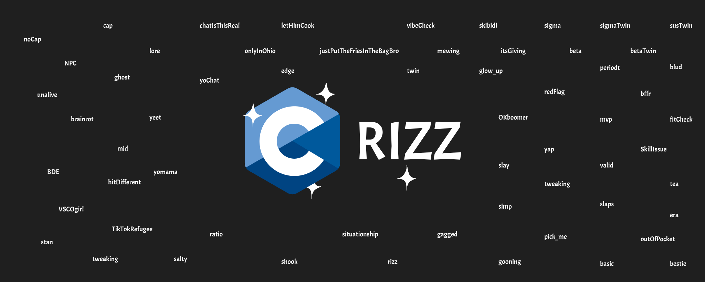
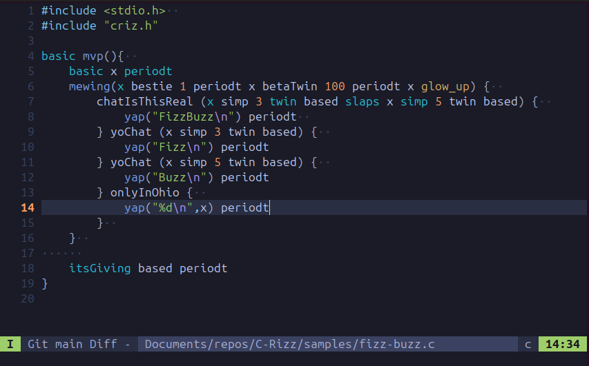
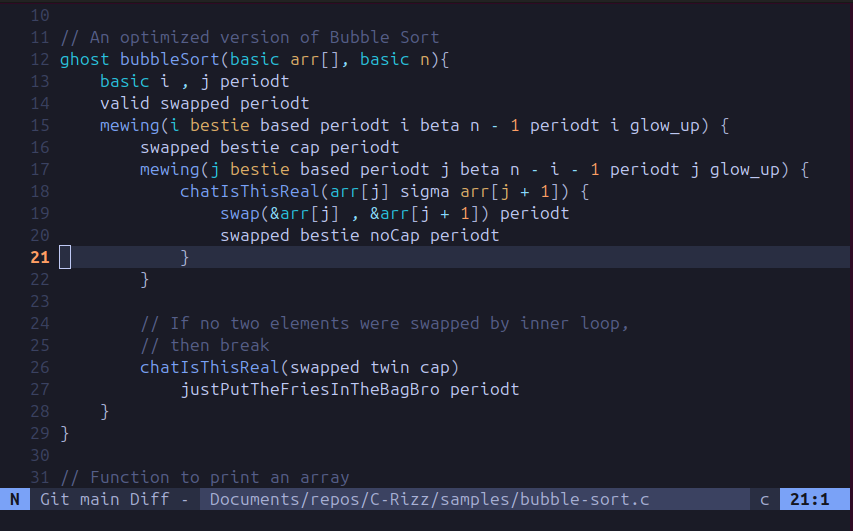

C-Rizz
======






Rev.: 1.0.0; The living standard.

A bussin language addition for brain ded gen-z C programmers. Inspired by [PyGyat](https://github.com/shamith09/pygyat).

This language is shown to 10x your development.

Also, new employers will have a huge pool of new low-wage slaves, cough, cough, workers since all the TikTokers need to spend their newfound attention on something new!

> DO NOT CONFUSE THIS PROJECT WITH JAVASCRIPT! They are not the same, JS is way worse.

I'm also considering doing an C3 compatible extension. So we can add keywords like: `await` `holdUp`...

> Why on earth would I create this? Well, to attract new talent.

Now you can make low-level programming and systems development even more complicated with this little gem. Looking forward to your use cases! 


⚡ Getting Started
-----------------

📦 Please check that you have the following dependencies installed:
- `criz.h`
- any C compiler

⬇️ Clone this repository to your machine. `git clone https://github.com/MatejCuljak/C-Rizz`

Include the `criz.h` header file in your project and enjoy your brain rot develop beyond a reversible stage.


📚 Documentation
----------------

C Rizz to C mapping:


|    C     |      C Rizz       |
|:-----------:|:------------------------:|
| Types        |             |
| int  | basic  |
|  char | outOfPocket  |
| bool  | valid  |
| float  |  gyatt |
| double  |  yomama |
| int*  |  basicSkillIssue |
|  char* |  outOfPocketSkillIssue |
| bool*  |  validSkillIssue |
| float*  |  gyattSkillIssue |
| double*  | yomamaSkillIssue  |
|  NPC | NULL |
| ghost | void | 
| Boolean Values (C22) | |
| noCap | true | 
| cap | false | 
| Type modifiers | |
| short  | mid  |
| long  | BDE  |
|  const | brainrot  |
|  unsigned | mog  |
|  signed | hitDifferent  |
| storage classes| |
|  auto | VSCOgirl  |
| extern  |  TikTokRefugee |
|  static |  stan |
| register  |  tweaking |
|  Structures |   |
|  skibidi | struct  |
| era  |  enum |
|  tea | union  |
| Numbers  |   |
| based  |  0 |
| Comments | |
| lore | // |
| Controle and Flow  |   |
|  chatIsThisReal | if  |
|  yoChat |  else if |
|  onlyInOhio |  else |
|  letHimCook |  while |
|  justPutTheFriesInTheBagBro | break  |
|  edge |  continue |
|  vibeCheck | switch  |
| mewing  | for  |
| pick_me  |  case |
| owned  |  default |
| itsGiving  | return  |
| Delimiter  |   |
| periodt  | ;  |
| Logic Operators  |   |
| slaps  | &&  |
| OKboomer  |  \|\| |
| sussyBaka  | !  |
| Comparison Operators||
|sigma|>|
|beta|<|
|sigmaTwin|>=|
|betaTwin |<=|
|susTwin|!=|
|twin|==|
| Bitwise Logic Operators  |   |
| afSlaps  | &  |
| situationship  | ^  |
| afOKboomer  | \|  |
| afsussyBaka  | ~  |
| gooning  | >>  |
| gagged  | <<  |
| Mathematical Operators  |   |
| glow_up  | ++  |
| redFlag  |  -- |
| rizz  | +  |
| snatched  | *  |
|  salty |  - |
| shook  |  / |
|  simp |  % |
|  Asigment Operators |   |
|  bestie |  = |
| rizzBestie  |  += |
| saltyBestie  | -=  |
| snatchedBestie  | *=  |
| shookBestie  | /=  |
|  simpBestie | %=  |
| Bitwise Asigment Operators  |   |
| gaggedBestie  | <<=  |
| gooningBestie  | >>=  |
| afSlapsBestie  |  &= |
| situationshipBestie  | ^=  |
| afOKboomerBestie  | /|=  |
| Functions  |   |
| unalive  | free  |
| blud  | malloc  |
| fitCheck  | realloc  |
| mvp  | main  |
| sus  | scanf  |
| susAura  |  fgets |
| yap  | printf  |
| bffr  |  strlen |
|  aura | fopen  |
| glaze  | fprintf  |
| cooked  | fclose  |
| yeet  | perror  |


Example programm:

`cat samples/fizz-buzz.c`

```c
#include <stdio.h>  
#include "criz.h"

basic mvp(){  
    basic x periodt
    mewing(x bestie 1 periodt x betaTwin 100 periodt x glow_up) {  
        chatIsThisReal (x simp 3 twin based slaps x simp 5 twin based) {  
            yap("FizzBuzz\n") periodt  
        } yoChat (x simp 3 twin based) {  
            yap("Fizz\n") periodt
        } yoChat (x simp 5 twin based) {  
            yap("Buzz\n") periodt
        } onlyInOhio {  
            yap("%d\n",x) periodt
        }  
    }  
      
    itsGiving based periodt
}
```

For more samples visit `samples/` directory.


> NOTE: This library's documentation is self-evident in the source (header) file.

#### In scope for this project
- Brainrot C and its few remaining developers.

#### Out of scope for this project
- Make an actual useful addition to C.


🤝 Feedback and Contributions
-----------------------------

For feedback, contact the repo's developer; for issues, please open an issues ticket; and for contributions, make sure to follow the contribution rules.

Feel free to fork this repository!


🧪 Testing
---------------

This language is utilized by braindead induviduals, so no testing is necessary.

Preliminary testing.

`gcc -o bubble-sort-test samples/bubble-sort.c`

`./bubble-sort-test`

```
Sorted array: 
11 12 22 25 34 64 90 % 
```

`gcc -o bubble-sort-test samples/fizz-buzz.c`
`./fizz-buzz-test`
```
1
2
Fizz
4
Buzz
Fizz
7
8
Fizz
Buzz
11
Fizz
13
14
FizzBuzz

...
```


🔁 Integrations
----------------

Integrates nicly in any existing C codebase and offers major refactoring potencial to make the existing codebases understandable to gen Z programers.


🎓 Certification
----------------

Certified by TikTok and Reddit users.


📕 REFFRENCES AND TECHNICAL QUIDES:
-----------------------------------

Syntax enligment(explanation): [https://en.wikipedia.org/wiki/Glossary_of_Generation_Z_slang](https://en.wikipedia.org/wiki/Glossary_of_Generation_Z_slang)


🤝 Support this project
-----------------------

As this is a challenging addition that requires hard, extensive, time-consuming, and continued development, any support will be greatly appreciated (as I'm just a student currently)!

☕ [Support Me Here](https://buymeacoffee.com/matejculjak)